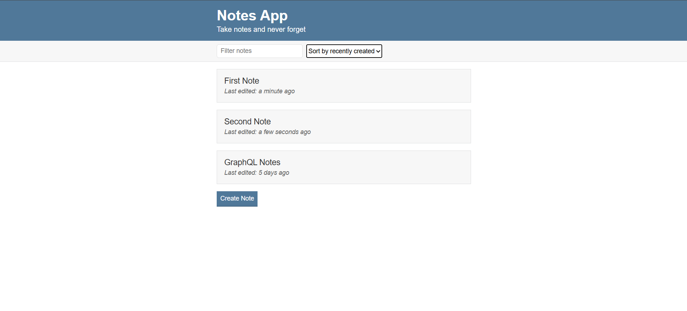
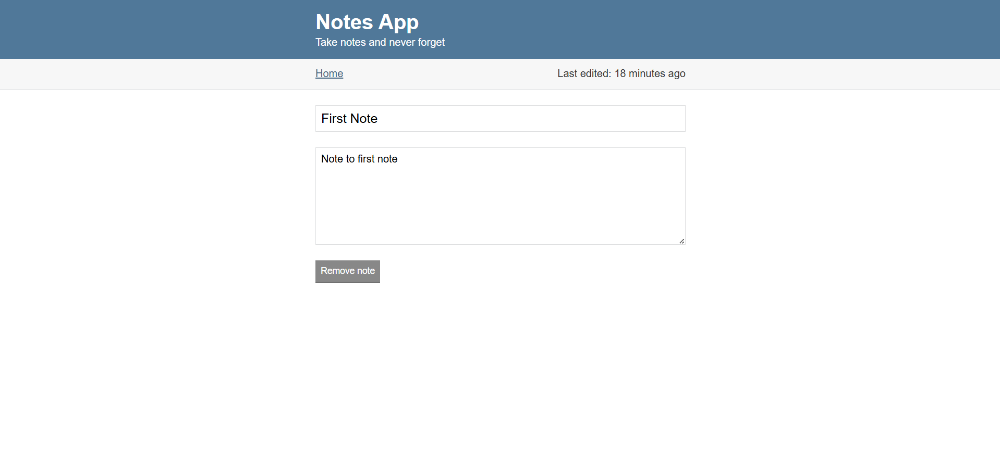

# NotesApp

A simple note-taking web application built with HTML, CSS and JavaScript.  
Users can create, edit, delete, search and sort notes. Notes are stored in the browser using localStorage.

## Preview

<p align="center">
  
</p>

## Screenshots

### Main Page


### Edit Page


## Features

- Create new notes
- Edit existing notes
- Delete notes
- Search notes by title
- Sort notes by:
  - last edited
  - recently created
  - alphabetical order
- Persistent storage with localStorage
- Last edited timestamp display

## Technologies Used

- HTML5
- CSS3
- Vanilla JavaScript
- localStorage
- Moment.js
- UUID

## Disclaimer

This project is for learning purposes and is based on an Udemy tutorial.

## Project Structure

```bash
NotesApp/
├── index.html
├── edit.html
├── scripts/
│   ├── notes-app.js
│   ├── notes-edit.js
│   ├── notes-functions.js
│   └── uuid.js
├── styles/
│   └── styles.css
└── images/
    ├── favicon.jpg
    ├── notes-app-preview.png
    └── edit-page.png
